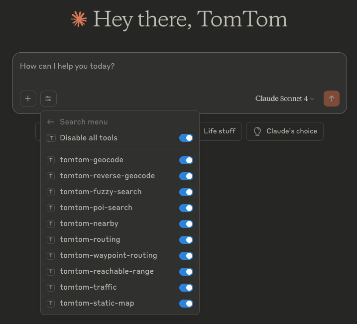

# Claude Desktop Integration Guide

This guide explains how to configure Claude Desktop to use the TomTom MCP Server for location-based queries.

## Prerequisites

- Claude Desktop installed
- Node.js 22+
- A valid [TomTom API key](https://developer.tomtom.com/)

## Setup

1. Add the following configuration to your `claude_desktop_config.json`:

    ```json
    {
      "mcpServers": {
         "tomtom-mcp": {
            "command": "npx",
            "args": ["-y", "@tomtom-org/tomtom-mcp@latest"],
            "env": {
               "TOMTOM_API_KEY": "<your_API_KEY>"
            }
         }
      }
   }
    ```

2. Restart Claude Desktop. You'll see the TomTom MCP tools in the Claude Desktop tools menu.



## Test It

Ask Claude a question like:

> "What’s the reachable range from Amsterdam within 30 minutes by car?"

If configured correctly, the MCP server will fetch results from TomTom APIs.

## Troubleshooting

- Ensure `TOMTOM_API_KEY` is valid and active.
- Check that the MCP server is accessible locally.

