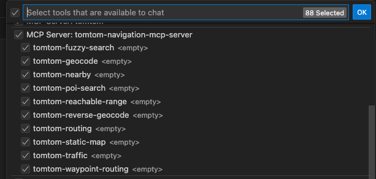

# VS Code Integration Guide

This guide explains how to configure VS Code to use the TomTom MCP Server for location-based queries.

## Prerequisites

- VS Code installed with Copilot
- Node.js 22+
- A valid [TomTom API key](https://developer.tomtom.com/)

## Setup

1. Add the below config in `.vscode/settings.json`:
    ```json
    {
      "servers": {
         "tomtom-mcp": {
            "command": "npx",
            "args": ["-y", "@tomtom-org/tomtom-mcp@latest"],
            "env": {
              "TOMTOM_API_KEY": "<your_API_KEY>"
            }
         }
      }
   }
   
2. You can see the TomTom MCP tools in Copilot tools menu.



## Troubleshooting

- Ensure **TOMTOM_API_KEY** is valid and active
- Check that the MCP server is running
- Review logs for connection errors