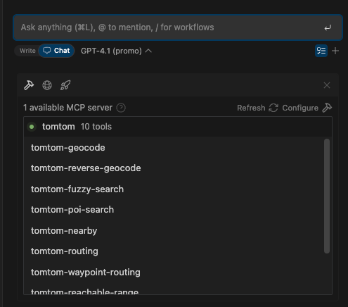

# WinSurf Integration Guide

This guide explains how to configure WinSurf to use the TomTom MCP Server for location-based queries.

## Prerequisites

- WinSurf installed
- Node.js 22+
- A valid [TomTom API key](https://developer.tomtom.com/)

## Setup

1. Add the below configuration to your` ~/.codeium/windsurf/mcp_config.json` file in the WindSurf directory:
   
    ```JSON
    {
      "mcpServers": {
         "tomtom-mcp": {
            "command": "npx",
            "args": ["-y","@tomtom-org/tomtom-mcp@latest"],
            "env": {
             "TOMTOM_API_KEY": "<your_API_KEY>"
            }
         }
      }
    }
   ```


## Test It

Use WinSurf's integration features to query the MCP server for map, routing, or search data.

## Troubleshooting

- Ensure `TOMTOM_API_KEY` is valid and active
- Check that the MCP server is running
- Review WinSurf logs for connection issues